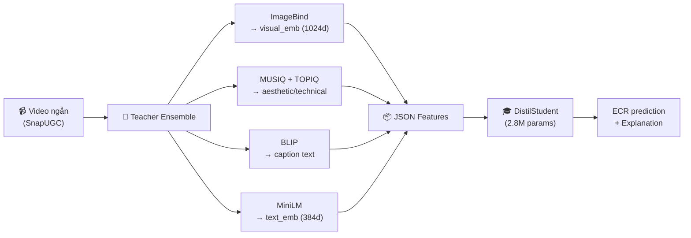
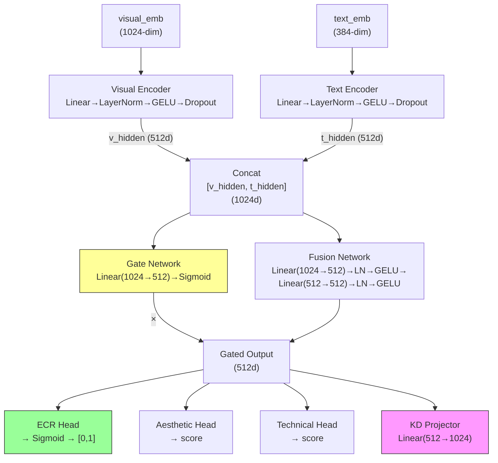

# Giải Thích Chi Tiết Code Notebook Distil-ShortVU

## 🗺️ Tổng Quan Luồng Dữ Liệu



**Ý tưởng cốt lõi:** Dùng các model lớn (teachers) để trích xuất đặc trưng 1 lần, lưu ra JSON. Sau đó train 1 model nhỏ (student) để học từ các đặc trưng đó → dự đoán ECR nhanh và nhẹ.

---

## Section 1-2: Setup & Config (Cells 0-4)

### Cell 2 — Import Libraries
```python
import torch, torchvision, numpy, pandas, PIL, tqdm, scipy, sklearn
```
Import tất cả thư viện cần thiết. Có đoạn hack để fix lỗi `pytorchvideo` trên torch mới:
```python
# Tạo module giả lập vì pytorchvideo (dùng bởi ImageBind) 
# cần function _max_value đã bị xóa trong torch mới
dummy_module = types.ModuleType('torchvision.transforms.functional_tensor')
```

### Cell 4 — Hyperparameters
```python
HIDDEN_DIM = 512      # Kích thước hidden layer trong student model
VISUAL_DIM = 1024     # ImageBind output dimension
TEXT_DIM = 384        # MiniLM output dimension  
DROPOUT = 0.2         # Regularization
BATCH_SIZE = 256      # Samples per batch
EPOCHS = 50           # Số vòng lặp training
LEARNING_RATE = 3e-4  # Tốc độ học
ECR_WEIGHT = 1.0      # Trọng số loss chính (dự đoán ECR)
AES_WEIGHT = 0.3      # Trọng số auxiliary loss (aesthetic)
TECH_WEIGHT = 0.3     # Trọng số auxiliary loss (technical)
KD_WEIGHT = 0.3       # Trọng số knowledge distillation loss
```

**Ý nghĩa:** Loss tổng = `1.0 × L_ECR + 0.3 × L_aesthetic + 0.3 × L_technical + 0.3 × L_KD`

---

## Section 3: Utility Functions (Cell 6)

```python
def set_seed(seed=42):     # Đảm bảo reproducibility
def count_parameters(model): # Đếm số params
def save_json(data, path):  # Lưu JSON
```

---

## Section 4: Load & Explore Data (Cell 8)

```python
train_df = pd.read_csv(TRAIN_CSV)   # 106,192 videos, CÓ ECR labels
val_df = pd.read_csv(VAL_CSV)       # 6,000 videos, KHÔNG CÓ ECR labels
```

> **Quan trọng:** Val CSV của SnapUGC không có ECR → ta phải tự tách train thành train/val split ở Cell 15.

**ECR distribution (train):** mean=0.498, std=0.290, range [0, 1)

---

## Section 5: Feature Extraction Pipeline (Cells 10-13)

Đây là bước **chạy 1 lần duy nhất**, dùng teacher models để trích xuất đặc trưng từ mỗi video.

### Cell 10 — Định nghĩa 4 Teacher Extractors

#### 1. QualityScorer (MUSIQ + TOPIQ)
```python
class QualityScorer:
    def score(self, video_path, num_frames=3):
        # Lấy 3 frames từ video (đều nhau)
        # Chạy MUSIQ → aesthetic score (0-10)
        #   MUSIQ output 0-100 → chia 10
        # Chạy TOPIQ → technical score (0-10)  
        #   TOPIQ output 0-1 → nhân 10
        return {"aesthetic": 6.5, "technical": 5.2}
```
- **MUSIQ**: Đánh giá chất lượng thẩm mỹ (màu sắc, bố cục, ánh sáng)
- **TOPIQ**: Đánh giá chất lượng kỹ thuật (độ nét, noise, artifacts)

#### 2. VideoCaptioner (BLIP)
```python
class VideoCaptioner:
    def caption(self, video_path):
        # Lấy frame giữa video
        # Chạy BLIP image captioning
        return "a dog playing on the beach"  # Mô tả nội dung bằng text
```

#### 3. VisualEncoder (ImageBind)
```python
class VisualEncoder:
    def embed(self, video_path, num_frames=4):
        # Lấy 4 frames, resize 224x224, normalize
        # Chạy ImageBind vision model
        # Output: vector 1024 chiều, đã L2 normalize
        return [0.023, -0.015, ..., 0.041]  # 1024 số thực
```
- **ImageBind** của Meta: Biểu diễn đa phương thức mạnh, map video/audio/text vào cùng không gian 1024 chiều.

#### 4. TextEncoder (MiniLM)
```python
class TextEncoder:
    def encode(self, title, description, caption):
        # Ghép: title + description + caption
        # Chạy sentence-transformers/all-MiniLM-L6-v2
        return [0.05, -0.03, ..., 0.02]  # 384 số thực
```

### Cell 12-13 — Chạy Feature Extraction

```python
def extract_features(csv_file, video_folder, output_file, max_videos):
    # Với mỗi video:
    #   1. QualityScorer.score() → aesthetic, technical
    #   2. VideoCaptioner.caption() → caption text
    #   3. VisualEncoder.embed() → visual_emb (1024-dim)
    #   4. TextEncoder.encode(title, description, caption) → text_emb (384-dim)
    #   5. Lưu tất cả vào JSON (~4s/video)
```

**Output JSON cho mỗi video:**
```json
{
    "video_id": "abc123",
    "ecr": 0.652,
    "visual_emb": [0.023, -0.015, ...],       // 1024 numbers
    "text_emb": [0.05, -0.03, ...],            // 384 numbers  
    "quality_scores": {"aesthetic": 6.5, "technical": 5.2},
    "caption": "a dog playing on the beach",
    "title": "Fun day at the beach",
    "description": "My dog loves water"
}
```

---

## Section 5.2: Train/Val Split (Cell 15)

```python
# Vì val_data.csv KHÔNG có ECR labels, ta phải tự chia:
train_data, val_data = train_test_split(
    valid_data,           # 5000 samples có features
    test_size=0.1,        # 10% làm val = 500 samples  
    random_state=42       # 90% làm train = 4500 samples
)
# Cả train_split.json và val_split.json đều CÓ ECR labels
```

---

## Section 6: Model Architecture — DistilStudent (Cell 17)

> **Đây là phần quan trọng nhất của khóa luận**

### Kiến trúc tổng thể



### Code từng phần:

#### Visual & Text Encoders
```python
# Ánh xạ từng modality về cùng không gian hidden_dim=512
self.visual_encoder = nn.Sequential(
    nn.Linear(1024, 512),    # 1024 → 512
    nn.LayerNorm(512),       # Normalize
    nn.GELU(),               # Activation  
    nn.Dropout(0.2),         # Regularization
)
self.text_encoder = nn.Sequential(
    nn.Linear(384, 512),     # 384 → 512
    nn.LayerNorm(512),
    nn.GELU(),
    nn.Dropout(0.2),
)
```
**Tại sao cần:** Visual là 1024d, text là 384d → cần project về cùng kích thước 512d để có thể kết hợp.

#### Gated Fusion (Cơ chế cổng)
```python
# Gate: học trọng số 0-1 cho mỗi chiều, quyết định
# bao nhiêu thông tin từ fusion tổng được giữ lại
self.gate = nn.Sequential(
    nn.Linear(512 * 2, 512),  # Input: [v_hidden; t_hidden]
    nn.Sigmoid(),              # Output: giá trị 0-1 cho mỗi chiều
)

# Fusion: MLP kết hợp 2 modalities
self.fusion = nn.Sequential(
    nn.Linear(512 * 2, 512),
    nn.LayerNorm(512), nn.GELU(), nn.Dropout(0.2),
    nn.Linear(512, 512),
    nn.LayerNorm(512), nn.GELU(), nn.Dropout(0.2),
)

# Forward:
concat = torch.cat([v_hidden, t_hidden], dim=-1)  # (B, 1024)
gate_weights = self.gate(concat)      # (B, 512) ∈ [0,1]
fused = self.fusion(concat)           # (B, 512)
fused = gate_weights * fused          # Element-wise multiply
```

**Tại sao Gated Fusion?**
- Mỗi video khác nhau: có video visual quan trọng hơn (video đẹp), có video text quan trọng hơn (title hấp dẫn)
- Gate tự động học trọng số cho từng video → linh hoạt hơn concat đơn giản
- `gate_weight ≈ 1` → giữ thông tin, `gate_weight ≈ 0` → bỏ qua

#### Task Heads (3 outputs)
```python
# 1. ECR Head (nhiệm vụ CHÍNH) — dự đoán engagement 0-1
self.ecr_head = nn.Sequential(
    nn.Linear(512, 256), nn.GELU(), nn.Dropout(0.2),
    nn.Linear(256, 1),
    nn.Sigmoid()    # ← Ép output về [0, 1]
)

# 2. Aesthetic Head (nhiệm vụ PHỤ) — dự đoán chất lượng thẩm mỹ
self.aesthetic_head = nn.Sequential(
    nn.Linear(512, 128), nn.GELU(), nn.Linear(128, 1)
)

# 3. Technical Head (nhiệm vụ PHỤ) — dự đoán chất lượng kỹ thuật
self.technical_head = nn.Sequential(
    nn.Linear(512, 128), nn.GELU(), nn.Linear(128, 1)
)
```

#### KD Projector (Knowledge Distillation)
```python
# Project student's hidden → teacher's embedding space (1024d)
# Để tính cosine similarity với ImageBind teacher embedding
self.kd_projector = nn.Sequential(
    nn.Linear(512, 1024),    # 512 → 1024 (same as ImageBind)
    nn.LayerNorm(1024),
)
```

### Hàm Loss Đa Nhiệm Vụ

```python
# Loss tổng = λ₁·L_ECR + λ₂·L_aes + λ₃·L_tech + λ₄·L_KD
loss = 0

# 1) L_ECR: MSE giữa predicted ECR và true ECR
ecr_loss = F.mse_loss(predicted_ecr, ecr_targets)
loss += 1.0 * ecr_loss

# 2) L_aesthetic: MSE giữa predicted aesthetic và teacher's aesthetic score
aes_loss = F.mse_loss(predicted_aesthetic, aesthetic_targets)
loss += 0.3 * aes_loss

# 3) L_technical: MSE giữa predicted technical và teacher's technical score  
tech_loss = F.mse_loss(predicted_technical, technical_targets)
loss += 0.3 * tech_loss

# 4) L_KD: 1 - cosine_similarity(student_projection, teacher_embedding)
student_proj = self.kd_projector(fused)        # (B, 1024)
kd_loss = 1.0 - F.cosine_similarity(student_proj, teacher_emb, dim=-1).mean()
loss += 0.3 * kd_loss
```

**Tại sao multi-task?**
- Aesthetic/Technical losses giúp student học thêm về chất lượng video → biểu diễn phong phú hơn
- KD loss ép student's representation gần với ImageBind teacher → chuyển giao tri thức

### Explainability — `get_feature_importance()`

```python
def get_feature_importance(self, visual_emb, text_emb):
    # Bước 1: Dự đoán bình thường (cả 2 modalities)
    full_ecr = model(visual_emb, text_emb)  # = 0.65

    # Bước 2: Tắt text (zero-out) → chỉ dùng visual
    vis_only_ecr = model(visual_emb, zeros)   # = 0.60

    # Bước 3: Tắt visual (zero-out) → chỉ dùng text  
    text_only_ecr = model(zeros, text_emb)    # = 0.30

    # Visual importance = |full - text_only| = |0.65 - 0.30| = 0.35
    # Text importance   = |full - vis_only|  = |0.65 - 0.60| = 0.05
    # → Visual đóng góp 87.5%, Text đóng góp 12.5%
```

**Ý tưởng:** Nếu tắt visual mà ECR thay đổi nhiều → visual quan trọng. Đây là phương pháp **ablation-based explanation**.

---

## Section 7: Dataset & DataLoader (Cell 19)

```python
class VideoFeaturesDataset(Dataset):
    def __getitem__(self, idx):
        item = self.data[idx]
        return {
            'visual_emb': tensor(1024),     # ImageBind embedding
            'text_emb': tensor(384),        # MiniLM embedding
            'ecr': tensor(scalar),          # Target ECR (0-1)
            'has_ecr': tensor(1 or 0),      # Có ECR label không?
            'aesthetic': tensor(scalar),    # Quality score / 10 → [0,1]
            'technical': tensor(scalar),    # Quality score / 10 → [0,1]
            'teacher_emb': tensor(1024),    # = visual_emb (clone) cho KD loss
        }
```

> `teacher_emb = visual_emb.clone()` — dùng ImageBind embedding làm teacher target cho KD loss.

---

## Section 8-9: Training (Cells 21, 23)

### `train_epoch()` — 1 epoch training

```python
for batch in dataloader:
    # 1. Forward pass
    outputs = model(visual_emb, text_emb, 
                    ecr_targets, aesthetic_targets, 
                    technical_targets, teacher_emb)
    
    # 2. Backward pass  
    loss = outputs['loss']  # Multi-task loss
    loss.backward()
    
    # 3. Gradient clipping (ngăn exploding gradients)
    clip_grad_norm_(model.parameters(), max_norm=1.0)
    
    # 4. Update weights
    optimizer.step()
```

### `evaluate()` — Đánh giá trên validation set

```python
# Tính: val_loss, ECR Pearson, Spearman, MAE
# Chỉ tính metrics cho samples có ECR (has_ecr=True)
```

### Training Loop (Cell 23)

```python
for epoch in range(1, 51):      # 50 epochs
    train_metrics = train_epoch(...)
    val_metrics = evaluate(...)
    
    # CosineAnnealing: learning rate giảm dần theo hình cos
    scheduler.step()
    
    # Lưu model tốt nhất (theo val_loss)
    if val_loss < best_val_loss:
        torch.save(model, "best_model.pth")
```

**CosineAnnealing scheduler:**
```
LR: 3e-4 ──╲                    ╱── 3e-6
             ╲                  ╱
              ╲    giảm dần   ╱
               ╲──────────╱
     Epoch 1              Epoch 50
```

---

## Section 10: Evaluation (Cells 25, 27)

```python
# Với mỗi sample trong val_split:
#   1. Forward pass → predicted ECR
#   2. get_feature_importance() → visual/text contribution
#   3. generate_explanation() → text giải thích bằng tiếng Anh

# Metrics tính:
#   Pearson:  Tương quan tuyến tính (-1 đến 1)
#   Spearman: Tương quan xếp hạng  
#   Kendall:  Tương quan xếp hạng (robust hơn)
#   MAE:     Sai số trung bình tuyệt đối
#   MSE:     Sai số trung bình bình phương
```

---

## Section 11: Visualization (Cells 29-38)

| Plot | Cho biết |
|------|---------|
| Training & Val Loss | Model có overfit không? |
| ECR Pearson over epochs | Model cải thiện theo epoch? |
| Scatter True vs Pred | Dự đoán sát thực tế? |
| Error distribution | Lỗi phân bố đều hay bias? |
| ECR distribution | Pred phân bố giống true? |
| Feature importance bar | Visual hay Text quan trọng hơn? |
| Inference time | Model nhanh không? |
| Gate weights histogram | Gate hoạt động thế nào? |
| Error by ECR range | ECR nào khó predict? |

---

## Section 13: Ablation Study (Cells 39-49)

### 13.1 Ablation Modality — Trả lời: "Cần cả 2 modalities không?"
```
Full (V+T):    dùng cả visual + text        → Pearson = ?
Visual only:   zero-out text embedding       → Pearson = ?  
Text only:     zero-out visual embedding     → Pearson = ?
```
**Kỳ vọng:** Full > Visual-only > Text-only → chứng minh cả 2 modalities đều có ích.

### 13.2 Ablation Fusion — Trả lời: "Gated fusion tốt hơn concat?"
```
ConcatStudent: concat rồi MLP (không có gate)
DistilStudent: concat + gate mechanism
```
**Kỳ vọng:** Gated > Concat → chứng minh gate mechanism giúp ích.

`ConcatStudent` giống `DistilStudent` nhưng **bỏ** `self.gate` — fusion output không nhân gate weights.

### 13.3 Ablation Strategy — Trả lời: "KD có giúp không?"
```
ECR only:     chỉ dùng L_ECR                    (λ_aes=0, λ_tech=0, λ_kd=0)
Multi-task:   L_ECR + L_aes + L_tech             (λ_kd=0)
Full KD:      L_ECR + L_aes + L_tech + L_KD      (đầy đủ, đề xuất)
```
**Kỳ vọng:** Full KD > Multi-task > ECR-only → chứng minh:
- Auxiliary tasks (aesthetic/technical) giúp regularize
- KD loss giúp chuyển giao tri thức từ teacher

---

## Section 14: Summary (Cell 51)

In tổng hợp tất cả kết quả: architecture, hyperparams, metrics, key findings.

---

## 🧠 Tóm Tắt Flow Toàn Bộ

```
1. LOAD DATA
   CSV (106k videos, ECR labels) + Video files

2. FEATURE EXTRACTION (chạy 1 lần, lưu JSON)
   Mỗi video → 4 teachers extract:
   ├── ImageBind  → visual_emb (1024d)
   ├── MUSIQ      → aesthetic score
   ├── TOPIQ      → technical score
   ├── BLIP       → caption text
   └── MiniLM     → text_emb (384d)

3. TRAIN/VAL SPLIT
   5000 samples → 4500 train + 500 val (all have ECR)

4. TRAIN STUDENT MODEL (50 epochs)
   Input:  visual_emb (1024d) + text_emb (384d)
   Model:  DistilStudent (gated fusion, 2.8M params)
   Loss:   L_ECR + 0.3*L_aes + 0.3*L_tech + 0.3*L_KD
   Output: predicted ECR (0-1)

5. EVALUATE
   Metrics: Pearson, Spearman, Kendall, MAE, MSE

6. ANALYSIS
   Feature importance, gate weights, error analysis

7. ABLATION STUDY
   Modality / Fusion / Strategy comparisons

8. SUMMARY
   Final results table
```
