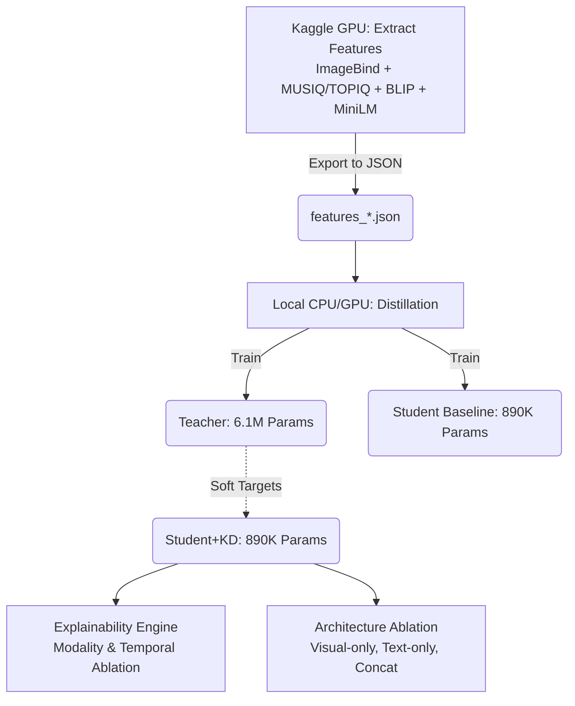

# Knowledge Distillation (KD) — Distil-ShortVU

This folder contains the complete pipeline for our Knowledge Distillation workflow taking a multimodal **Teacher** (understanding both visual, textual, and video quality aspects) and distilling it into a lightweight **Student** model. It also includes comprehensive modules for architectural **ablation** and a novel **explainability engine** (Temporal Ablation).

---

## 1. Overall Pipeline & Workflow

Deploying deep learning on video datasets is heavily constrained by GPU memory. Therefore, our pipeline is separated into two stages: **1. Heavy Feature Extraction (GPU)** and **2. Efficient Training & Distillation (Local CPU/GPU)**.



### Time Estimation (Example for 500-2000 Videos on Mid-range CPU)
Since feature extraction is done separately, the entire distillation and experiment suite is very fast locally:
- **Teacher Training (100 epochs)**: ~8 minutes
- **Student Baseline & KD (120 epochs)**: ~5-10 minutes
- **Ablation Models**: ~10 minutes
- **Explainability Export**: < 1 minute
- **Total Local End-to-End Run**: ~30 minutes.

---

## 2. Setup & Data Format

From the project root, install all prerequisites:

```bash
pip install -r requirements.txt
```
*(Requires PyTorch, scipy, numpy, pandas. You can use `--device mps` for Apple M-series chips or `--device cuda` for Nvidia GPUs).*

Your pre-extracted JSON file must follow this structure for every sample:
- `ecr`: Engagement label (float)
- `visual_emb`: 1024-d array (ImageBind)
- `text_emb`: 384-d array (MiniLM)
- `quality_scores`: `{ "aesthetic": float, "technical": float }` mapped to a 0–10 scale.
- Optionally: `video_id`, `title`, `caption`.

---

## 3. Training & Running the Experiment E2E

Use the central `run_experiment.py` script. It will sequentially train the Teacher, Student Baseline, and Student with KD.

### Quick Smoke Test
If you just want to verify the code runs without crashing (uses very few epochs):
```bash
python3 source/kd/run_experiment.py \
  --data source/kaggle_kd/results/500_videos/features_500.json \
  --save-dir results_kd_local \
  --device cpu \
  --quick
```

### Full E2E Experiment (Recommended for Final Reporting)
This command trains models reliably and exports rigorous explainability and ablation studies:

```bash
python3 source/kd/run_experiment.py \
  --data source/kaggle_kd/results/500_videos/features_500.json \
  --save-dir results_kd_local \
  --device cpu \
  --teacher-epochs 100 \
  --student-epochs 120 \
  --batch 32 \
  --alpha 0.3 \
  --beta 0.1 \
  --gamma 0.2 \
  --delta 0.2 \
  --explain --explain-n 20 \
  --ablation
```

**Key Arguments:**
- `--alpha 0.3`: Weight for ECR soft target distillation (Teacher's ECR output).
- `--beta 0.1`: Weight for Representation KD limit (Cosine similarity between hidden dimensions).
- `--gamma 0.2` & `--delta 0.2`: Auxiliary task weights for predicting Aesthetic & Technical scores respectively.
- `--explain`: Automatically computes Modality Ablation (Visual vs Text impact) and prepares LLM Prompts in `explanations.json`.
- `--ablation`: Automatically kicks off standalone trainings to compare the Gated Cross-Attention to Visual-only, Text-only, and blind Concat-fusion. Results outputed to `ablation_report.json`.

**After it finishes, you will find under `--save-dir`:**
`teacher_best.pth`, `student_baseline_best.pth`, `student_kd_best.pth`, `ablation_*.pth`, `experiment_report.json` (PLCC, SRCC, MSE metrics), `explanations.json`, and `ablation_report.json`.

---

## 4. Sub-modules & Standalone usage

### 4.1 Explainability Engine (`explainability.py`)

You can run Modality Ablation on a pre-extracted JSON feature dictionary:

```bash
python3 source/kd/explainability.py \
  --model results_kd_local/student_kd_best.pth \
  --data source/kaggle_kd/results/500_videos/features_500.json \
  --out results_kd_local/explanations.json \
  --n 10 --prompt --device cpu
```

**Temporal Ablation (The Hook Discovery)**
`explainability.py` also features an Advanced **Inference API** (`find_engaging_hook_frame`) designed to work on **raw MP4 videos**. By sequentially zeroing-out (blacking) frames, the logic mathematically defines which frame affects the expected Engagement Score the most.

**Usage within a Web App Inference backend:**
```python
from source.kd.explainability import find_engaging_hook_frame, ExplainabilityEngine

# 1. Discover the Hook (Extract 4 frames, Zero-out sequentially, get max ECR drop)
hook_info = find_engaging_hook_frame(
    video_path="path/to/upload_video.mp4", 
    student_model=student_kd_model,
    visual_encoder=imagebind_model,
    captioner=blip2_captioner,
    text_emb=text_embedding_tensor,
    device="cuda" # or cpu
)

# 2. Extract modality contributions
engine = ExplainabilityEngine(student_kd_model, "cuda")
explanations = engine.explain(visual_emb, text_emb, video_meta)

# 3. Generate scientifically-grounded Prompt for LLMs (No Hallucination)
prompt = engine.generate_llm_prompt(explanation=explanations, temporal_ablation=hook_info)
print(prompt)
```

### 4.2 Architecture Ablation Study (`ablation_study.py`)
Compare how the gated fusion architecture measures up to simpler models.

```bash
python3 source/kd/ablation_study.py \
  --data source/kaggle_kd/results/500_videos/features_500.json \
  --kd-model results_kd_local/student_kd_best.pth \
  --baseline-model results_kd_local/student_baseline_best.pth \
  --teacher-model results_kd_local/teacher_best.pth \
  --out results_kd_local/ablation_report.json \
  --epochs 60 --batch 32 --device cpu
```

---

## 5. KD Hyperparameter Tuning Guide

If you observe that **Student+KD underperforms Student-Baseline** (verify easily through `kd_gain_plcc < 0` in `experiment_report.json`), use the following systematic approach:

1. **Lower `beta` (e.g., 0.05 - 0.1):** `L_repr` dominates early during training. Too much restriction prevents tuning towards actual ECR targets. 
2. **Increase Epochs (e.g., 100 -> 150):** The Student network needs sufficient iterations to learn the KD representations before optimizing its Regression Head effectively.
3. **Decrease `alpha` (e.g., 0.2):** If your Teacher is weak/unreliable on very small datasets, forcing the Student to mimic a wrong Teacher ruins general performance. Trust the hard ECR label more.
4. **Learning Rate & Batch Size:** Large batches add stability internally. Stay within `-lr=3e-4 to 1e-3` for students.

---

## File map

| File | Role |
|------|------|
| `models.py` | PyTorch architectures for `TeacherModel`, `StudentModel` (Gated Cross-Attention) |
| `run_experiment.py` | CLI orchestrator (Train + compare + optional ablation/explain) |
| `explainability.py` | Explainable AI (Modality ablation, Quality heads reading, Temporal hook finding) |
| `ablation_study.py` | Baseline structural benchmarks & inference benchmarking (latency) |
| `extract_features.py` | Teacher Embedders → JSON features (Executed mostly on Kaggle GPU) |
| `test_pipeline.py` | Sandbox for synthetic E2E testing |
